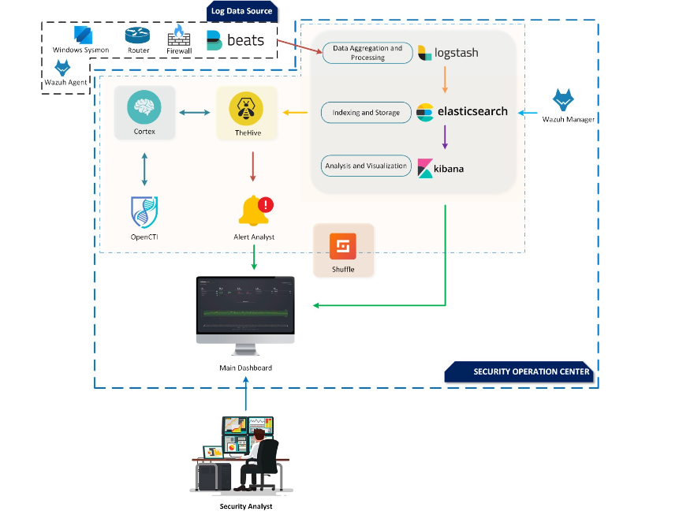

# Open-Source Based SOC: A Future of Empowerment
The future of SOCs is open-source, and this project is your gateway to that future. Embrace the cost-effectiveness, flexibility, and community-driven power to build a security watchtower that empowers your organization to stand tall against the ever-evolving threats of the digital age. My Project Designed for Security Analysts and all SOC audiences who wants to play with implementation and explore the Modern SOC architecture.Here used all the tools/components are Open-Source based and fully free of costs.
## Why Open-Source?
Building an open-source SOC doesn't mean compromising on functionality.There's a plethora of powerful tools available to cover all aspects of security operations. Open source brings transparency, flexibility, and a vibrant community to the table, offering several advantages:
* **Cost-Effective:** Ditch the hefty price tags and embrace free, community-driven tools. Security shouldn't be a privilege reserved for the financially fortified.
* **Customization:** Craft your SOC to your specific needs. Open-source allows you to bend and shape the tools to fit your workflows, not the other way around.
* **Transparency and Trust:** Open code means vulnerabilities are exposed and patched swiftly, fostering trust and confidence in your SOC's capabilities.
* **Community of Vigilance:** Never stand alone. A dedicated open-source community provides constant updates, bug fixes, and support, ensuring your SOC evolves alongside the threats.

## Building Your Own Open-Source based SOC:
Creating an effective open-source SOC requires careful planning and execution. and also have to concern about these following staffs:
* **Assessment:** Identify your security needs and resources to design the appropriate architecture.
* **Tool Selection:** Choose the open-source tools that best fit your specific requirements and workflows.
* **Integration:** Seamlessly integrate chosen tools for efficient data flow and analysis.
* **Team Training:** Invest in training your team to proficiently use and manage the open-source tools.
* **Community Engagement:** Actively participate in the open-source community to benefit from updates, support, and collaboration.

## Tools(Open-Source) used in My project :
My project is fully open source based and it is not just a collection of tools; it's a comprehensive SOC ecosystem designed for efficient threat detection, investigation, and response. Here's what you get:
* **Log Management and SIEM:** Wazuh Manager (ElK stack,Wazuh server, Kibana) and Graylog offer centralized log collection, analysis, and visualization.
* **Intrusion Detection and Prevention:** Snort and Suricata monitor network traffic for malicious activity, while Zeek or Zabbix (formerly Bro) provides deep network analysis.
* **Threat Intelligence:** MISP (Malware Information Sharing Platform) and OpenCTI facilitates collaboration and intelligence sharing among security teams.
* **Security Orchestration and Response(SOAR):** Shuffle automates incident response workflows, streamlining investigation and remediation.
* **Case Management:** TheHive is very powerfull tools to generates and keep tracks of security case events.
* **Vulnerability Management:** OpenVAS scans systems for vulnerabilities, while Nessus offers in-depth vulnerability assessment.

## SOC Architecture:

## Basic Components:
* **Wazuh Manager SIEM:** Open source SIEM platform powered by Wazuh Server, ELK stack, Kibana.
* **TheHive4:** TheHive is a scalable 3-in-1 open source and free Security Incident Response Platform designed to make life easier for SOCs, CSIRTs, CERTs and any information security practitioner dealing with security incidents that need to be investigated and acted upon swiftly.
* **Cortex:** Cortex, an open source and free software, has been created by TheHive Project for this very purpose. Observables, such as IP and email addresses, URLs, domain names, files or hashes, can be analyzed one by one or in bulk mode using a Web interface. Analysts can also automate these operations thanks to the Cortex REST API.
* **MISP:** MISP is an open source software solution for collecting, storing, distributing and sharing cyber security indicators and threats about cyber security incidents analysis and malware analysis. MISP is designed by and for incident analysts, security and ICT professionals or malware reversers to support their day-to-day operations to share structured information efficiently.
* **OpenCTI:** OpenCTI is an open source platform allowing organizations to manage their cyber threat intelligence knowledge and observables. It has been created in order to structure, store, organize and visualize technical and non-technical information about cyber threats.
* **Shuffle SOAR:** Shuffle is an automation platform for and by the community, focusing on accessibility for anyone to automate. Security operations is complex, but it doesn't have to be.
* **Suricata :** Suricata is the foremost Open Source Intrusion Prevention System (IPS) in the world.
*  **Zabbix:** Zabbix is an open-source software tool to monitor IT infrastructure such as networks, servers, virtual machines, and cloud services. Zabbix collects and displays basic metrics to get you better insight about you Network infrustuctures.

## Additional Components: 
In the above components are sufficient but further more if you want to enrich your arsenal, then you may add the following tools:
* ***Snort:*** SNORT is an open-source intrusion detection and prevention system that provides real-time network traffic analysis and data packet logging.
* ***OPNSense:*** OPNsense is an open source, FreeBSD-based firewall and routing software developed by Deciso, a company in the Netherlands that makes hardware and sells support packages for OPNsense. Its a very powerfull Tools for Network regulations.
* ***Velociraptor:*** Velociraptor is an advanced digital forensic and incident response tool that enhances your visibility into your endpoints.
* ***Cuckoo Sanbox:*** Cuckoo Sandbox is the leading open source automated malware analysis system that automated the task of analyzing any malicious file under Windows, macOS, Linux, and Android.
* ***Prometheus:*** Prometheus is a systems and service monitoring system. It collects metrics from configured targets at given intervals, evaluates rule expressions, displays the results, and can trigger alerts when specified conditions are observed.

## Installation-Requirements:
I have created the environment in Proxmox VE. You can follow along or choose any other alternative cloud provider like AWS. Or ever you can utilize EKS to deploy the full setup. And all the components are very resources hungry and depends on your usages like how many assets you gonna monitor, how much data you want to proceed and so on. So here I am giving you a basic idea about minimal requirements needed to run every components.
| Components   | OS | CPU | RAM|
|-------|------|------|------|
|Wazuh Manager | ubuntu22.04 | 8 Core | 16 GB|
|TheHive| ubuntu22.04 | 4 Core | 8 GB |
|Cortex| ubuntu22.04 | 4 Core | 8 GB |
|Shuffle| ubuntu22.04 | 6 Core | 8 GB |
|OpenCTI| ubuntu22.04 | 8 Core | 12 GB |

