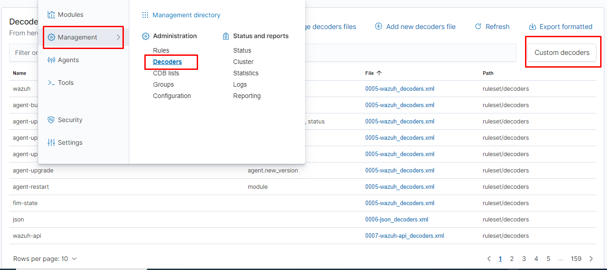
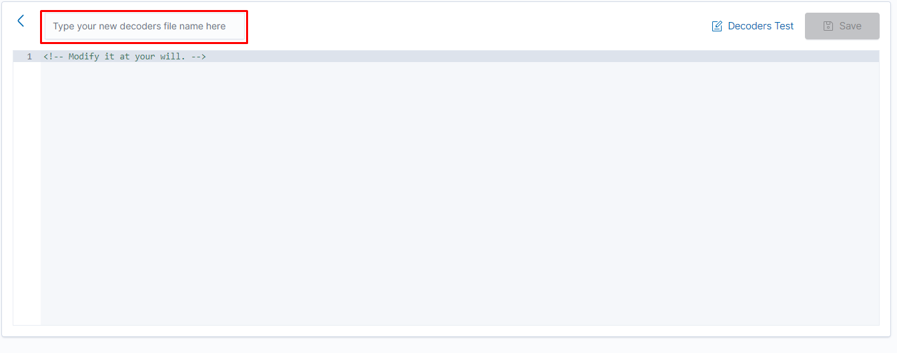

## Wazuh Log Decoder
Wazuh Manager is incredibly effective in parsing data and decoding a variety of log formats to provide deeper understanding of the endpoint that are being monitored. There are a ton of preconfigured log decoders included. Wazuh is yet unable to decode all kinds of logs, nevertheless. Wazuh therefore provides you with the ability to create and develop your own custom log decoding capability for new log types. 

## Custom Decoder
Customize the Wazuh decoders to fit your needs and enhance detection capabilities. To achieve this, you can:
* Modify the default decoders.
* Add new custom decoders.
## Add New Custom Decoder
To add new custom decoder in wazuh, you may add new file at `/var/ossec/etc/decoders/local_decoder.xml` or go to wazuh manager UI and nevigate Managements>Decoders>Custom decoders

After that then click on add new decoder button to add you new custom decoder.

